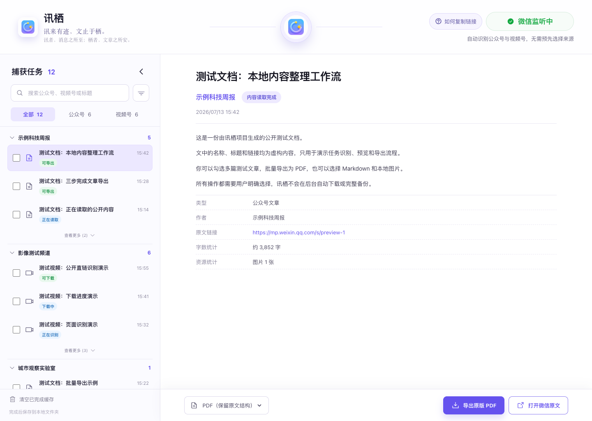
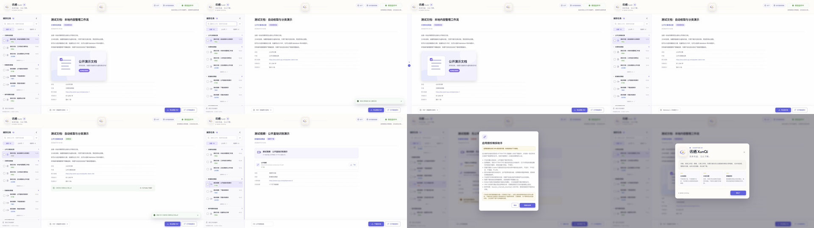
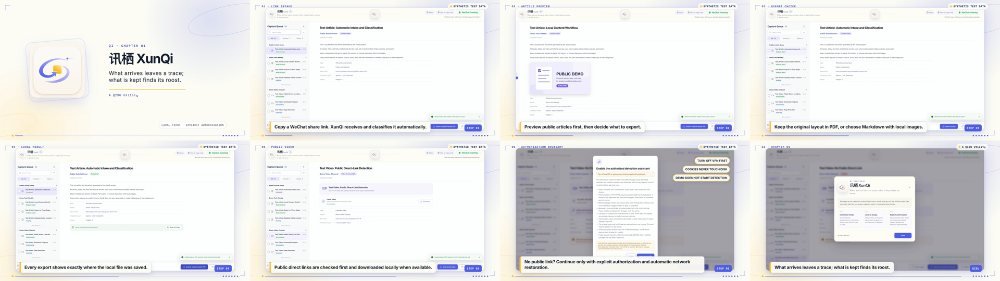

# 讯栖 XunQi · 栖

> 讯来有迹，文止于栖。
> What arrives leaves a trace; what is kept finds its roost.

**A QIDU Utility**

讯者，消息之所至；栖者，文章之所安。讯栖是一款本地优先的微信链接捕获与导出工具：它在用户主动复制分享链接后识别公众号文章或视频号页面，让用户自行查看、选择并保存到本地。

当前版本是公开预发布版，主要用于 Mac 与 Windows 双平台调试。仓库截图、测试数据和演示链接均为虚构内容，不包含真实公众号、视频号或用户任务。



## 双语演示素材

| 中文｜微信公众号 | English｜X |
| --- | --- |
| [](assets/publishing/zh/video/xunqi-demo-zh.mp4) | [](assets/publishing/en/video/xunqi-demo-en.mp4) |

- 中文：[`8 张截图`](assets/publishing/zh/screenshots/) · [`29 秒 MP4`](assets/publishing/zh/video/xunqi-demo-zh.mp4) · [`SRT`](assets/publishing/zh/video/xunqi-demo-zh.srt)
- English: [`8 screenshots`](assets/publishing/en/screenshots/) · [`29-second MP4`](assets/publishing/en/video/xunqi-demo-en.mp4) · [`SRT`](assets/publishing/en/video/xunqi-demo-en.srt)

两套素材均来自真实运行的本地预览界面，并使用同一组虚构公开测试数据。生成方式、隐私边界和校验信息见 [双语发布素材说明](docs/PUBLISHING-ASSETS.md)。

## 下载预发布包

| 平台 | 压缩包 | 当前状态 |
| --- | --- | --- |
| macOS Apple Silicon | `XunQi-0.5.0-beta.1-macOS-arm64-source-preview.zip` | 可运行源码预览；无 `.app` |
| Windows | `XunQi-<版本>-Windows-source-BAT-preview.zip` | 待下一预发布；仅源码 + BAT，不含 EXE / 安装器 |

请从 [GitHub Releases](https://github.com/Yifo98/XunQi/releases) 下载。当前 `v0.5.0-beta.1` 仅保留 macOS 包；Windows 源码 + BAT 包会在原生 Windows 流程验收后随下一预发布提供。所有公开版本暂时都标记为 **Pre-release**。

macOS 包包含源码、运行文件和 `.command` 启动器。Windows 包调整为：

```text
XunQi-版本-Windows-source-BAT-preview/
├── Launch-XunQi.bat
├── README-Windows.txt
└── source/               # 与本次发布对应的完整源码；不含 EXE / MSI / CMD
```

Windows 旧版 `runtime/XunQi.exe` 预发布物已经撤下。BAT 会检查 Node.js、pnpm 和 Rust，在本机从源码编译后启动；因此首次运行需要开发工具和网络连接。这减少了直接分发未知未签名 EXE 的问题，但 **BAT 不能绕过 Smart App Control**：Windows 仍可能检查 BAT 启动的工具和本地生成的程序。详见 [Smart App Control 评估](docs/SMART-APP-CONTROL.md)。

当前 Windows 预览版没有商业代码签名。签名不是讯栖的功能依赖，在系统没有拦截时不影响功能使用；它主要用于让 Windows 验证发布者身份和文件完整性。“未签名”不等于恶意软件，也不会让讯栖获得额外权限。Windows 包源码公开可审阅，不读取微信聊天记录、通讯录、本地数据库或密码，不提供云端账号、远程数据库或遥测上报。若遇拦截，请按 [Windows 拦截处理步骤](docs/SMART-APP-CONTROL.md#用户遇到拦截时) 先核对来源、校验值和提示类型；讯栖不会自动关闭系统安全功能。

## 使用方法

1. 完整解压 ZIP。
2. macOS 双击 `Launch-XunQi.command`；Windows 安装 Node.js 22、pnpm 11、Rust stable 与 MSVC 构建工具后，双击 `Launch-XunQi.bat`。
3. 在微信中复制分享链接：
   - 公众号：打开文章，点击右上角三个点或四个点，选择“复制链接”。
   - 视频号：点击分享箭头，选择“复制链接”。
4. 微信位于前台时，讯栖会识别随后复制的新链接。也可以把链接直接粘贴到左侧搜索框。
5. 查看识别结果后，再手动导出文章或下载视频。

Windows 源码已经补上原生微信前台识别，支持 `WeChat.exe`、`Weixin.exe` 和视频号子进程 `WeChatAppEx.exe`。进入微信时程序只建立剪贴板基线，不会把旧链接误收取；随后复制的新链接才会进入任务列表。当前公开 Windows 包不再携带预编译的讯栖 EXE。

## 当前功能

- 公众号公开文章读取与任务整理。
- 单篇或批量导出保留原文结构的 PDF。
- 导出 Markdown 与本地图片文件夹。
- 识别页面公开提供的 HTTPS 视频文件并手动下载。
- macOS 上可由用户明确授权临时启用视频号嗅探助手。
- 显示下载进度、速度、保存目录和已知媒体信息。
- 删除任务时同步清理讯栖内部正文、资源和识别缓存，不删除用户已经导出的文件。

## 平台差异与限制

| 能力 | macOS | Windows |
| --- | --- | --- |
| 微信前台复制链接监听 | 支持 | 支持，0.5.0-beta.1 起 |
| 直接粘贴链接收取任务 | 支持 | 支持 |
| 公众号 PDF / Markdown 导出 | 支持 | 支持；PDF 依赖 Microsoft Edge |
| 公开视频直链下载 | 支持 | 支持 |
| 授权嗅探下载 | 支持 Apple Silicon 预览 | 暂不支持 |
| 代码签名 / 公证 | 未公证 | 不分发预编译 EXE；本地开发构建仍未签名 |

微信公众号和视频号没有向第三方提供“输入名称即可持续连接并读取全部更新”的公开接口。讯栖只处理用户主动复制或粘贴的分享链接，不读取聊天记录、微信本地数据库或密码。

视频号公开分享页经常不直接提供媒体地址。macOS 授权嗅探会临时修改系统代理并信任一张本地会话证书，存在明确风险与平台限制。启用前请阅读 [安全说明](docs/SECURITY.md) 与 [隐私说明](docs/PRIVACY.md)，关闭 VPN 和其他系统代理，使用完立即结束并恢复网络。讯栖不提供录屏保存，也不绕过 DRM 或内容访问权限。

## 本地开发

需要 Node.js 22、pnpm 11、Rust stable，以及 Tauri 对应平台的系统依赖。

```bash
pnpm install --frozen-lockfile
pnpm check
pnpm tauri dev
```

macOS 生成“源码＋运行文件＋启动器”预发布包：

```bash
pnpm package:portable:mac
```

Windows“源码 + BAT”候选包由 [Windows source and BAT preview](.github/workflows/windows-source-preview.yml) 在原生 Windows Runner 校验并生成：

```powershell
pnpm package:source:win
```

工作流会拒绝把 `.exe`、`.dll`、`.msi`、`.msix`、`.appx`、`.cmd` 等 Windows 可执行或安装文件放进 ZIP。不要把 BAT 描述成 Smart App Control 绕过方案，也不要在 Mac 上伪造 Windows 原生验收结果。

## 项目文档

- [发布与验收](docs/RELEASES.md)
- [路线图](docs/ROADMAP.md)
- [隐私说明](docs/PRIVACY.md)
- [安全说明](docs/SECURITY.md)
- [公众号评论能力研究](docs/COMMENT-RESEARCH.md)
- [双语发布素材](docs/PUBLISHING-ASSETS.md)
- [Windows Smart App Control 评估](docs/SMART-APP-CONTROL.md)

## 许可证

讯栖原创代码和资源采用 [MIT License](LICENSE)。可选的 `wx_channels_download` 助手属于第三方组件，采用其自己的许可证并包含 Commons Clause；详情见 [第三方许可](assets/portable/第三方许可-wx_channels_download.txt)。

请只处理你有权访问和保存的内容，并遵守微信平台规则、内容权利人的授权条件和所在地法律。
