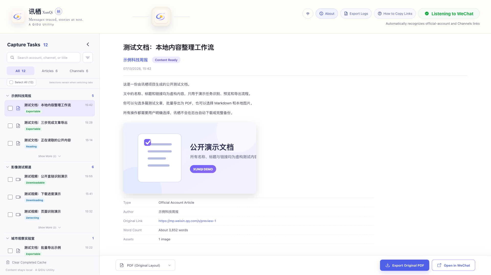

# 讯栖 XunQi · 栖

> 讯来有迹，文止于栖。
> What arrives leaves a trace; what is kept finds its roost.

**A QIDU Utility**

讯者，消息之所至；栖者，文章之所安。讯栖是一款本地优先的微信链接捕获与导出工具：它在用户主动复制分享链接后识别公众号文章或视频号页面，让用户自行查看、选择并保存到本地。

当前正式版本为 **0.5.1**。本次同步 macOS Apple Silicon 的最新工作台布局、中英文界面与诊断导出能力；Windows 发布暂时搁置，本次 Release 不提供 Windows 下载资产。仓库截图、测试数据和演示链接均为虚构内容，不包含真实公众号、视频号或用户任务。

## 0.5.1 当前界面

| 中文工作台 | English workspace |
| --- | --- |
|  |  |

截图由 `0.5.1` 当前源码的隔离预览后端生成，展示语言切换、诊断日志导出、全选入口和响应式顶部操作区；任务名称、标题与链接全部为虚构测试数据。

## 0.5.0 双语流程演示（归档）

| 中文｜微信公众号 | English｜X |
| --- | --- |
| [](assets/publishing/zh/video/xunqi-demo-zh.mp4) | [](assets/publishing/en/video/xunqi-demo-en.mp4) |

- 中文：[`8 张截图`](assets/publishing/zh/screenshots/) · [`29 秒 MP4`](assets/publishing/zh/video/xunqi-demo-zh.mp4) · [`SRT`](assets/publishing/zh/video/xunqi-demo-zh.srt)
- English: [`8 screenshots`](assets/publishing/en/screenshots/) · [`29-second MP4`](assets/publishing/en/video/xunqi-demo-en.mp4) · [`SRT`](assets/publishing/en/video/xunqi-demo-en.srt)

两套 29 秒素材记录的是 `0.5.0` 的操作流程；工作流仍适用，但按钮位置与视觉布局请以本页上方的 `0.5.1` 当前截图为准。素材均来自真实运行的本地预览界面，并使用同一组虚构公开测试数据。生成方式、隐私边界和校验信息见 [双语发布素材说明](docs/PUBLISHING-ASSETS.md)。

## 下载正式版

| 平台 | 压缩包 | 当前状态 |
| --- | --- | --- |
| macOS Apple Silicon | `XunQi-0.5.1-macOS-arm64-source.zip` | 正式版；包含运行文件、源码和 `.command` 启动器，无 `.app` |
| Windows x64 | — | 暂停发布；仓库中的试验适配不作为可下载正式包 |

请从 [GitHub Releases](https://github.com/Yifo98/XunQi/releases/tag/v0.5.1) 下载。普通用户只需下载 macOS ZIP；`.sha256` 是完整性校验文件，不是另一个程序包。

macOS 包包含与 Release 同一提交的源码、三个 Apple Silicon 运行文件和 `.command` 启动器。顶部和“关于”页都可以导出不含 Cookie、聊天记录、正文、分享链接、密码或令牌的诊断 TXT。

ZIP 中保留公开仓库的跨平台源码；其中的 Windows 试验适配、Runner 和安全评估文档只供后续研究。没有通过新的完整真机门禁前，GitHub Release 不会提供 Windows 运行包，也不会在 Mac 上伪造 Windows 产物。

## 使用方法

1. 完整解压 ZIP。
2. macOS 双击 `Launch-XunQi.command`。本次 Release 不提供 Windows 正式包。
3. 在微信中复制分享链接：
   - 公众号：打开文章，点击右上角三个点或四个点，选择“复制链接”。
   - 视频号：点击分享箭头，选择“复制链接”。
4. 微信位于前台时，讯栖会识别随后复制的新链接。也可以把链接直接粘贴到左侧搜索框。
5. 查看识别结果后，再手动导出文章或下载视频。

Windows 试验实现仍保留在源码中，但本页“当前功能”与下载说明均以 macOS `v0.5.1` 正式包为准。

## 当前功能

- 公众号公开文章读取与任务整理。
- 界面支持中文 / English 一键切换；捕获到的标题、正文和视频内容保持原文。
- 按当前全部/公众号/视频号筛选结果一键全选，并在切换分类时保留已选任务。
- 单篇或批量导出保留原文结构的 PDF。
- 导出 Markdown 与本地图片文件夹。
- 识别页面公开提供的 HTTPS 视频文件并手动下载。
- macOS 上可由用户明确授权临时启用视频号嗅探助手。
- 视频号支持“原始画质”与“节省空间（微信默认）”两种真实下载策略；连续授权期间保持同一策略。
- 多条视频可进入单任务校验队列，完成一条后自动接续下一条；当前不同时运行多个授权嗅探任务。
- 显示下载进度、速度、保存目录和已知媒体信息。
- 删除任务时同步清理讯栖内部正文、资源和识别缓存，不删除用户已经导出的文件。
- 顶部“导出日志”（“关于”页同样可用）可随时导出本地运行诊断；只含时间、版本、平台、受控事件和错误分类，不含用户内容或凭据。

## 平台差异与限制

| 能力 | macOS | Windows |
| --- | --- | --- |
| 微信前台复制链接监听 | 支持 | 暂停发布 |
| 直接粘贴链接收取任务 | 支持 | 暂停发布 |
| 公众号 PDF / Markdown 导出 | 支持 | 暂停发布 |
| 公开视频直链下载 | 支持 | 暂停发布 |
| 授权嗅探下载 | 支持 Apple Silicon | 暂不支持 |
| 代码签名 / 公证 | ad-hoc 签名，未公证 | 无本次发布包 |

微信公众号和视频号没有向第三方提供“输入名称即可持续连接并读取全部更新”的公开接口。讯栖只处理用户主动复制或粘贴的分享链接，不读取聊天记录、微信本地数据库或密码。

视频号公开分享页经常不直接提供媒体地址。macOS 授权嗅探会临时修改系统代理并信任一张本地会话证书，存在明确风险与平台限制。启用前请阅读 [安全说明](docs/SECURITY.md) 与 [隐私说明](docs/PRIVACY.md)，关闭 VPN 和其他系统代理，使用完立即结束并恢复网络。讯栖不提供录屏保存，也不绕过 DRM 或内容访问权限。

## 本地开发

需要 Node.js 22、pnpm 11、Rust stable，以及 Tauri 对应平台的系统依赖。

```bash
pnpm install --frozen-lockfile
pnpm check
pnpm tauri dev
```

macOS 生成“源码＋运行文件＋启动器”正式包：

```bash
pnpm package:portable:mac
```

Windows 研究工作流仍保留在仓库中，仅供后续恢复开发时使用：

```powershell
pnpm package:runtime:win
```

当前不会从该工作流发布 Windows 资产。恢复开发后仍须经过 Windows Runner、真机功能和 Smart App Control 门禁；不要把 BAT 描述成安全策略绕过方案。

## 项目文档

- [0.5.1 正式版说明](docs/release-notes-0.5.1.md)
- [0.5.0 正式版说明](docs/release-notes-0.5.0.md)
- [发布与验收](docs/RELEASES.md)
- [路线图](docs/ROADMAP.md)
- [隐私说明](docs/PRIVACY.md)
- [安全说明](docs/SECURITY.md)
- [公众号评论能力研究](docs/COMMENT-RESEARCH.md)
- [双语发布素材](docs/PUBLISHING-ASSETS.md)
- [Windows Smart App Control 评估](docs/SMART-APP-CONTROL.md)

## 许可证

讯栖原创代码和资源采用 [MIT License](LICENSE)。可选的 `wx_channels_download` 助手属于第三方组件，采用其自己的许可证并包含 Commons Clause；详情见 [第三方许可](assets/portable/第三方许可-wx_channels_download.txt)。

请只处理你有权访问和保存的内容，并遵守微信平台规则、内容权利人的授权条件和所在地法律。
